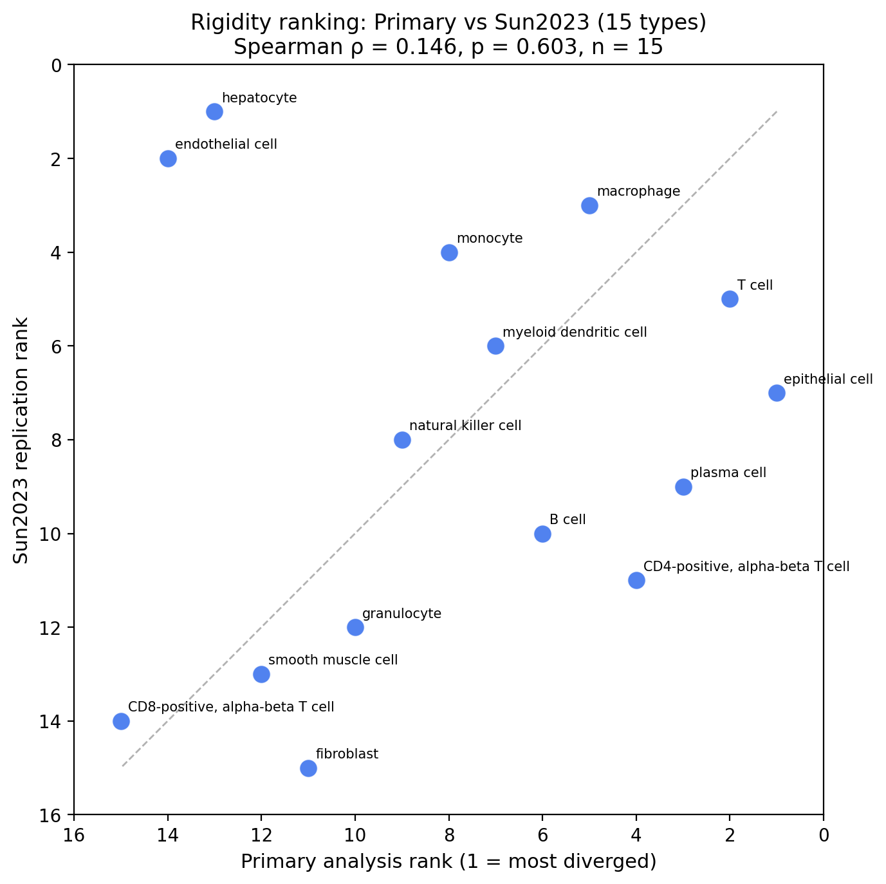
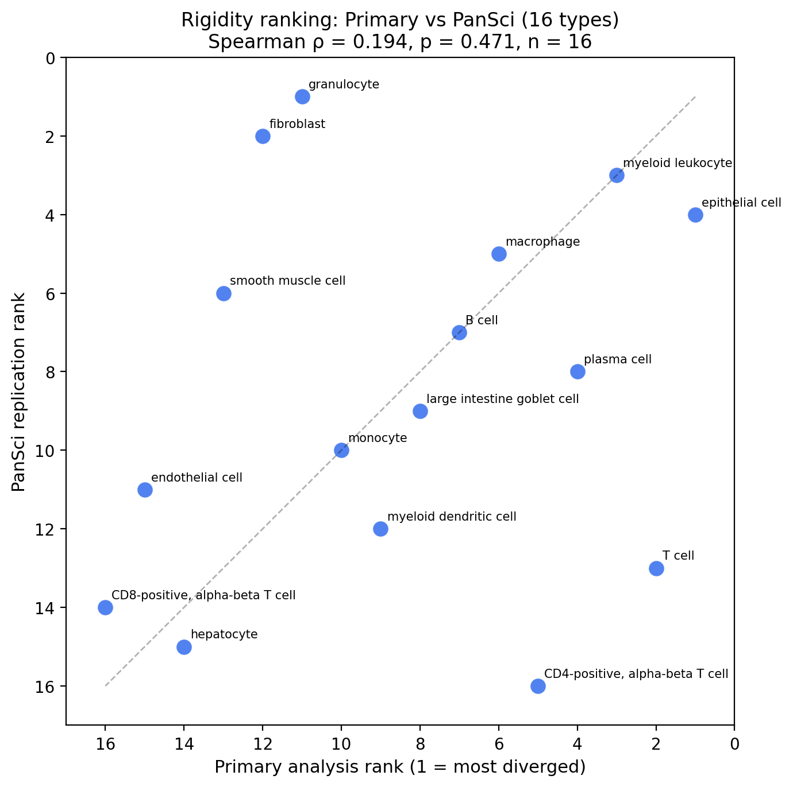
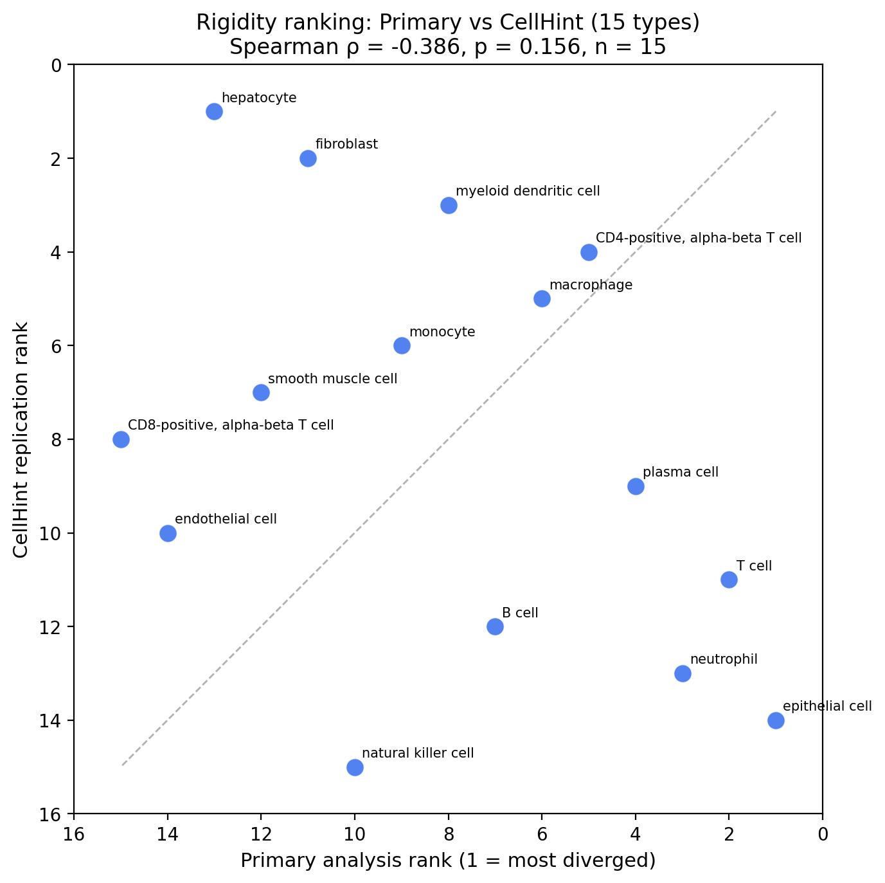

# Ranking Replication Analysis

**Question:** Do per-cell-type rigidity rankings (Procrustes residual
magnitudes) replicate across independent datasets?

**Method:** For each replication dataset, we identified cell types shared
with the primary 35-type analysis, re-ranked within the shared subset, and
computed Spearman rank correlation (ρ) between primary and replication rankings.

## Per-Dataset Correlation Summary

| Dataset | N shared types | Spearman ρ | p-value | Interpretation |
|---------|---------------|-----------|---------|----------------|
| Sun2023 (15 types) | 15 | 0.146 | 0.6025 | Not significant |
| PanSci (16 types) | 16 | 0.194 | 0.4713 | Not significant |
| CellHint (15 types) | 15 | -0.386 | 0.1556 | Not significant |

### Sun2023 (15 types)

Shared cell types: **15** | Spearman ρ = **0.146** | p = **0.6025**

| Cell Type | Primary Rank | Replication Rank | Rank Shift |
|-----------|:------------|:----------------|:----------|
| epithelial cell | 1 | 7 |  **6** |
| T cell | 2 | 5 | 3 |
| plasma cell | 3 | 9 |  **6** |
| CD4-positive, alpha-beta T cell | 4 | 11 |  **7** |
| macrophage | 5 | 3 | 2 |
| B cell | 6 | 10 | 4 |
| myeloid dendritic cell | 7 | 6 | 1 |
| monocyte | 8 | 4 | 4 |
| natural killer cell | 9 | 8 | 1 |
| granulocyte | 10 | 12 | 2 |
| fibroblast | 11 | 15 | 4 |
| smooth muscle cell | 12 | 13 | 1 |
| hepatocyte | 13 | 1 |  **12** |
| endothelial cell | 14 | 2 |  **12** |
| CD8-positive, alpha-beta T cell | 15 | 14 | 1 |

**Largest rank shifts:**
- hepatocyte: shifted 12 positions (primary #13 → replication #1)
- endothelial cell: shifted 12 positions (primary #14 → replication #2)
- CD4-positive, alpha-beta T cell: shifted 7 positions (primary #4 → replication #11)

### PanSci (16 types)

Shared cell types: **16** | Spearman ρ = **0.194** | p = **0.4713**

| Cell Type | Primary Rank | Replication Rank | Rank Shift |
|-----------|:------------|:----------------|:----------|
| epithelial cell | 1 | 4 | 3 |
| T cell | 2 | 13 |  **11** |
| myeloid leukocyte | 3 | 3 | 0 |
| plasma cell | 4 | 8 | 4 |
| CD4-positive, alpha-beta T cell | 5 | 16 |  **11** |
| macrophage | 6 | 5 | 1 |
| B cell | 7 | 7 | 0 |
| large intestine goblet cell | 8 | 9 | 1 |
| myeloid dendritic cell | 9 | 12 | 3 |
| monocyte | 10 | 10 | 0 |
| granulocyte | 11 | 1 |  **10** |
| fibroblast | 12 | 2 |  **10** |
| smooth muscle cell | 13 | 6 |  **7** |
| hepatocyte | 14 | 15 | 1 |
| endothelial cell | 15 | 11 | 4 |
| CD8-positive, alpha-beta T cell | 16 | 14 | 2 |

**Largest rank shifts:**
- T cell: shifted 11 positions (primary #2 → replication #13)
- CD4-positive, alpha-beta T cell: shifted 11 positions (primary #5 → replication #16)
- granulocyte: shifted 10 positions (primary #11 → replication #1)

### CellHint (15 types)

Shared cell types: **15** | Spearman ρ = **-0.386** | p = **0.1556**

| Cell Type | Primary Rank | Replication Rank | Rank Shift |
|-----------|:------------|:----------------|:----------|
| epithelial cell | 1 | 14 |  **13** |
| T cell | 2 | 11 |  **9** |
| neutrophil | 3 | 13 |  **10** |
| plasma cell | 4 | 9 |  **5** |
| CD4-positive, alpha-beta T cell | 5 | 4 | 1 |
| macrophage | 6 | 5 | 1 |
| B cell | 7 | 12 |  **5** |
| myeloid dendritic cell | 8 | 3 |  **5** |
| monocyte | 9 | 6 | 3 |
| natural killer cell | 10 | 15 |  **5** |
| fibroblast | 11 | 2 |  **9** |
| smooth muscle cell | 12 | 7 |  **5** |
| hepatocyte | 13 | 1 |  **12** |
| endothelial cell | 14 | 10 | 4 |
| CD8-positive, alpha-beta T cell | 15 | 8 |  **7** |

**Largest rank shifts:**
- epithelial cell: shifted 13 positions (primary #1 → replication #14)
- hepatocyte: shifted 12 positions (primary #13 → replication #1)
- neutrophil: shifted 10 positions (primary #3 → replication #13)

## Combined Stability Analysis

Cell types appearing in ≥2 replications are classified by mean absolute rank shift:
- **Stable** (≤2.0): ranking is reproducible across datasets
- **Moderate** (2.1–4.0): some ranking variability
- **Volatile** (>4.0): ranking is dataset-dependent

| Cell Type | N datasets | Mean Rank Shift | Max Shift | Classification | Primary Rank (of 35) |
|-----------|:----------|:---------------|:---------|:--------------|:---------------------|
| myeloid leukocyte | 1 | 0.0 | 0 | insufficient data | 10 |
| large intestine goblet cell | 1 | 1.0 | 1 | insufficient data | 19 |
| macrophage | 3 | 1.3 | 2 | stable | 16 |
| monocyte | 3 | 2.3 | 4 | moderate | 22 |
| B cell | 3 | 3.0 | 5 | moderate | 17 |
| natural killer cell | 2 | 3.0 | 5 | moderate | 23 |
| myeloid dendritic cell | 3 | 3.0 | 5 | moderate | 21 |
| CD8-positive, alpha-beta T cell | 3 | 3.3 | 7 | moderate | 35 |
| smooth muscle cell | 3 | 4.3 | 7 | volatile | 31 |
| plasma cell | 3 | 5.0 | 6 | volatile | 12 |
| granulocyte | 2 | 6.0 | 10 | volatile | 27 |
| CD4-positive, alpha-beta T cell | 3 | 6.3 | 11 | volatile | 14 |
| endothelial cell | 3 | 6.7 | 12 | volatile | 33 |
| epithelial cell | 3 | 7.3 | 13 | volatile | 2 |
| fibroblast | 3 | 7.7 | 10 | volatile | 28 |
| T cell | 3 | 7.7 | 11 | volatile | 7 |
| hepatocyte | 3 | 8.3 | 12 | volatile | 32 |
| neutrophil | 1 | 10.0 | 10 | insufficient data | 8 |

## Key Findings

### Correlation Results
- **Sun2023** (ρ = 0.146): Not significant positive correlation
- **PanSci** (ρ = 0.194): Not significant positive correlation
- **CellHint** (ρ = -0.386): Not significant negative correlation

### Stability Summary
- **Stable types** (1): macrophage
- **Moderate types** (5): monocyte, B cell, natural killer cell, myeloid dendritic cell, CD8-positive, alpha-beta T cell
- **Volatile types** (9): smooth muscle cell, plasma cell, granulocyte, CD4-positive, alpha-beta T cell, endothelial cell, epithelial cell, fibroblast, T cell, hepatocyte

### Interpretation

Per-type rigidity rankings trend positive across replications, though statistical significance varies with sample size. The direction of the correlation is consistent, suggesting an underlying biological signal modulated by dataset-specific factors (tissue representation, cell counts, protocol differences).

---
*Generated: 2026-04-05*